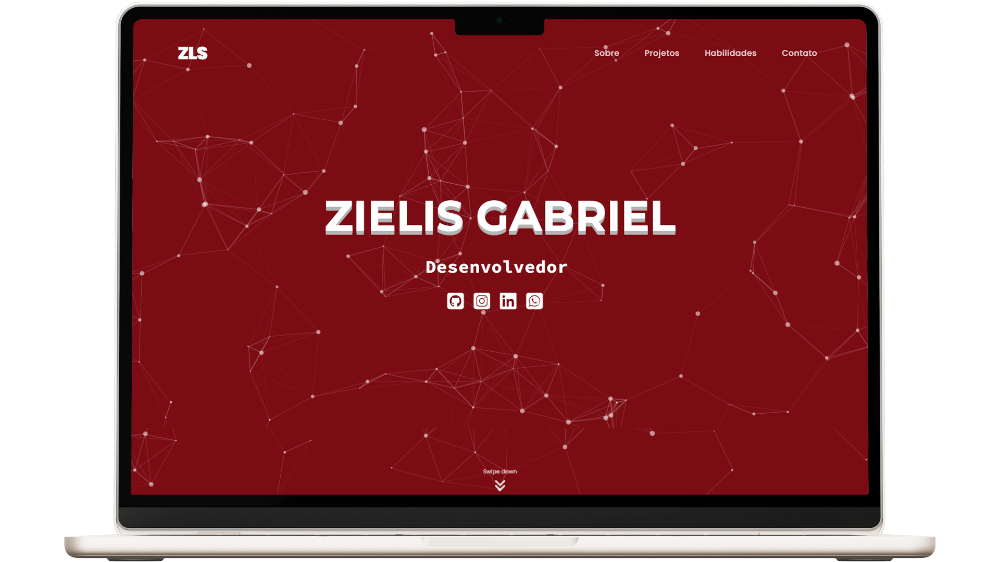

# Meu Portfólio Pessoal | Web Developer

#### Bem-vindo ao repositório do meu portfólio como desenvolvedor web! Este projeto foi criado utilizando **HTML**, **CSS** e **JavaScript**, com a integração de bibliotecas como **AOS** para animações e **particles.js** para efeitos visuais.

---

## ⚡ Funcionalidades Principais

### 🔍 **Visão Geral**
- **Interface moderna e responsiva**: Adaptada para diferentes tamanhos de tela, garantindo uma experiência consistente em dispositivos móveis e desktops.
- **Efeitos de anímação**: Elementos animados ao entrar no viewport utilizando a biblioteca **AOS** para criar uma experiência visual mais dinâmica e envolvente.
- **Efeito interativo de partículas**: Utilização do **particles.js** na seção inicial, adicionando um toque de criatividade ao layout.

### 🔖 **Seções Disponíveis**

#### ● **Sobre**
- Uma breve apresentação pessoal.
- Lista das principais habilidades e tecnologias dominadas, incluindo frameworks, bibliotecas e ferramentas.
- Link direto para download do currículo atualizado em formato PDF.

#### ● **Projetos**
- Galeria com exemplos de projetos desenvolvidos.
- Descrição detalhada de cada projeto, incluindo funcionalidades, desafios enfrentados e as tecnologias utilizadas, como HTML, Javascript, Node.js, entre outros.

#### ● **Habilidades**
- Principais tecnologias destacadas com descrições detalhadas, como desenvolvimento frontend e backend.

#### ● **Contato**
- Links para as redes sociais mais relevantes:
  - WhatsApp para mensagens diretas.
  - Telegram para comunicação rápida.
  - Linkedin para networking profissional.
  - Instagram para conteúdo mais informal e pessoal.
  - GitHub com repositórios de códigos e projetos.
- Possibilidade de enviar mensagens diretamente para propostas de desenvolvimento ou colaborações.

---

## 🛠️ **Tecnologias Utilizadas**

- **HTML5**
- **CSS3**
- **JavaScript (ES6+)**
- **[AOS](https://michalsnik.github.io/aos/)** (Animate On Scroll)
- **[particles.js](https://vincentgarreau.com/particles.js/)**

### Extras:
- Uso de métodos modernos de CSS, como Flexbox e Grid.
- Boas práticas de acessibilidade (ARIA).
- Estruturas otimizadas para SEO (Search Engine Optimization).

---

## 💡 **Melhorias Futuras**

- Implementação de um sistema de blog para compartilhar conhecimentos e experiências.
- Tradução para múltiplos idiomas, como inglês e espanhol.
- Adição de testes automatizados para garantir a qualidade do código.

## 🔗 **Link do Site**

- [Meu Portfólio | José Gabriel Almeida Silveira](https://zielisgabriel.vercel.app)

